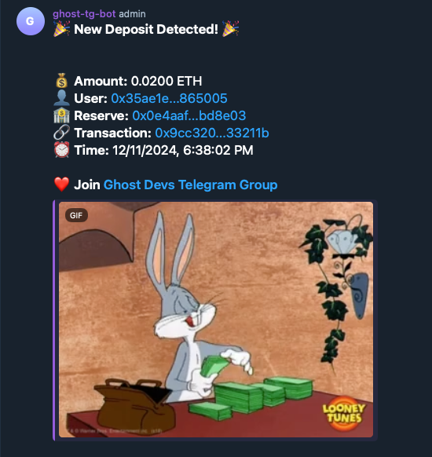

# Example: Build and power a Telegram bot with Ghost

A Telegram bot that monitors and announces new deposits on the blockchain using Ghost.
The bot sends beautifully formatted messages with transaction details and celebratory GIFs to your specified Telegram
channels.

This example demonstrates monitoring deposits for Zeru Finance.



## 🚀 Quick Start

1. Fork the GhostGraph from [Ghost](https://app.ghostlogs.xyz/graphShares/e4c74feb-79aa-4574-9dfa-4381681ef920)
2. Clone this repository
3. Copy `.env.example` to `.env`
4. Configure your environment variables
5. Install dependencies and run the bot

## 📋 Prerequisites

- Node.js 16.x or higher
- npm or yarn
- A Telegram account
- Access to [Ghost](https://app.ghostlogs.xyz/)
- Follow [this blog article](https://docs.tryghost.xyz/blog/blog/query_data_with_ghost_for_telegram_bot_on_berachain) for step-by-step walkthrough

## 🔧 Configuration

Copy `.env.example` to `.env`:

```bash
cp .env.example .env
```

### Environment Variables

1. **TELEGRAM_BOT_TOKEN**
    - Create a new bot using [@BotFather](https://t.me/botfather) on Telegram
    - Send `/newbot` to BotFather and follow the instructions
    - Copy the provided token to `TELEGRAM_BOT_TOKEN`

2. **GHOST_GRAPH_URL**
    - Fork the GhostGraph from [here](https://app.ghostlogs.xyz/graphShares/e4c74feb-79aa-4574-9dfa-4381681ef920)
    - Go to your forked graph
    - Click "Deploy" button
    - Copy the provided query URL to `GHOST_GRAPH_URL`

3. **CHANNEL_IDS**
    - Add your bot to the desired Telegram channels as an admin
    - To get a channel's ID, you have several options:
        1. Use the Web Version:
            - Open your channel in web.telegram.org
            - The channel ID will be in the URL after the hash (#)
            - You'd want to replace `#-` with `-100`
            - For example, `#-1234564363` will turn into `-1001234564363`
    - For multiple channels, separate IDs with commas
    - Example: `CHANNEL_IDS="-1001234567890,-1009876543210"`

Example `.env` file:

```env
TELEGRAM_BOT_TOKEN=1234567890:ABCdefGHIjklMNOpqrsTUVwxyz
GHOST_GRAPH_URL=https://api.ghostlogs.xyz/gg/pub/uniqueIdHere/ghostgraph
CHANNEL_IDS=<YOUR_CHANNEL_ID>
```

## 🏃‍♂️ Running the Bot

1. Install dependencies:

```bash
npm install
# or
yarn install
```

2. Start the bot:

```bash
npm start
# or
yarn start
```

## 📝 Message Format

Each deposit notification includes:

- Amount in ETH
- User address (with explorer link)
- Reserve address (with explorer link)
- Transaction hash (with explorer link)
- Timestamp
- Random celebratory GIF

## 🔍 Troubleshooting

1. **Bot not sending messages?**
    - Verify the bot is an admin in the channel
    - Double-check the channel IDs
    - Ensure your `TELEGRAM_BOT_TOKEN` is correct

2. **No events being received?**
    - Verify your GhostGraph is properly forked and deployed
    - Check the `GHOST_GRAPH_URL` is correct
    - Ensure the query url endpoint is accessible

## 💬 Support

If you have any questions or need help, join our Telegram community
at [https://t.me/ghostlogsxyz](https://t.me/ghostlogsxyz)

## 📜 License

This project is licensed under the MIT License - see the [LICENSE-MIT](LICENSE-MIT) file for details.

## 🤝 Contributing

Contributions are welcome! Please feel free to submit a Pull Request.